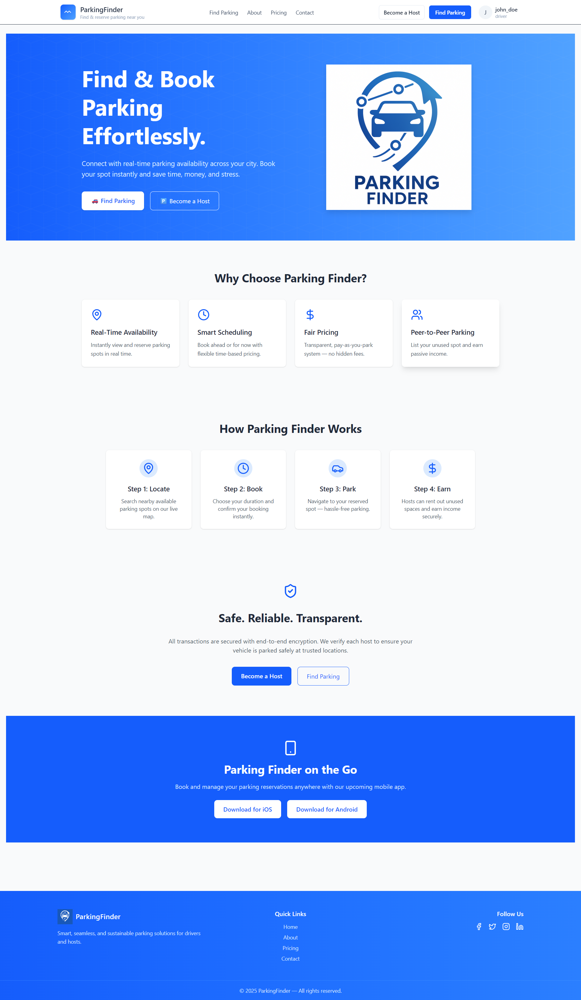
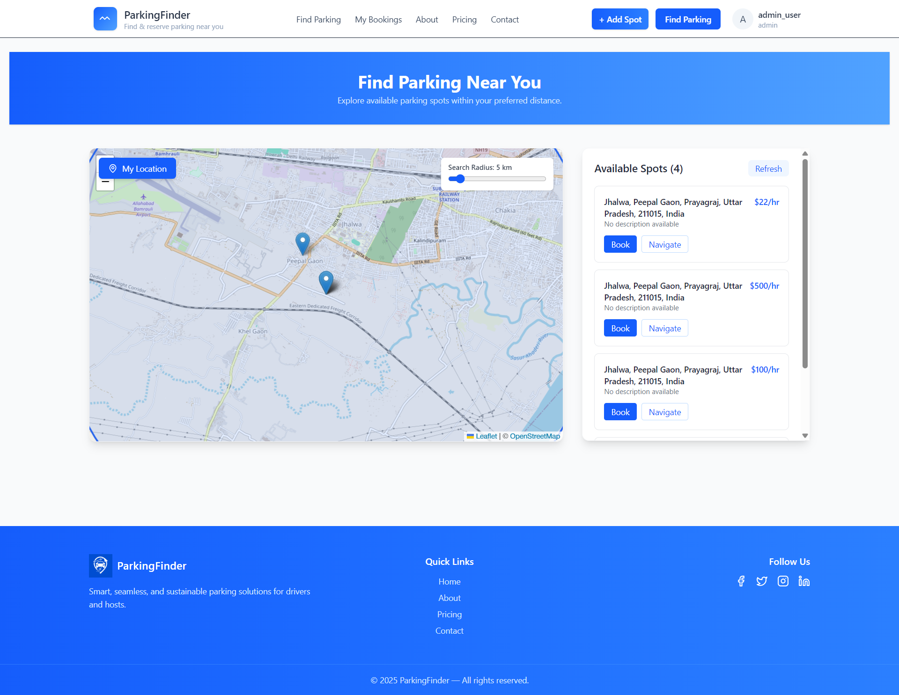
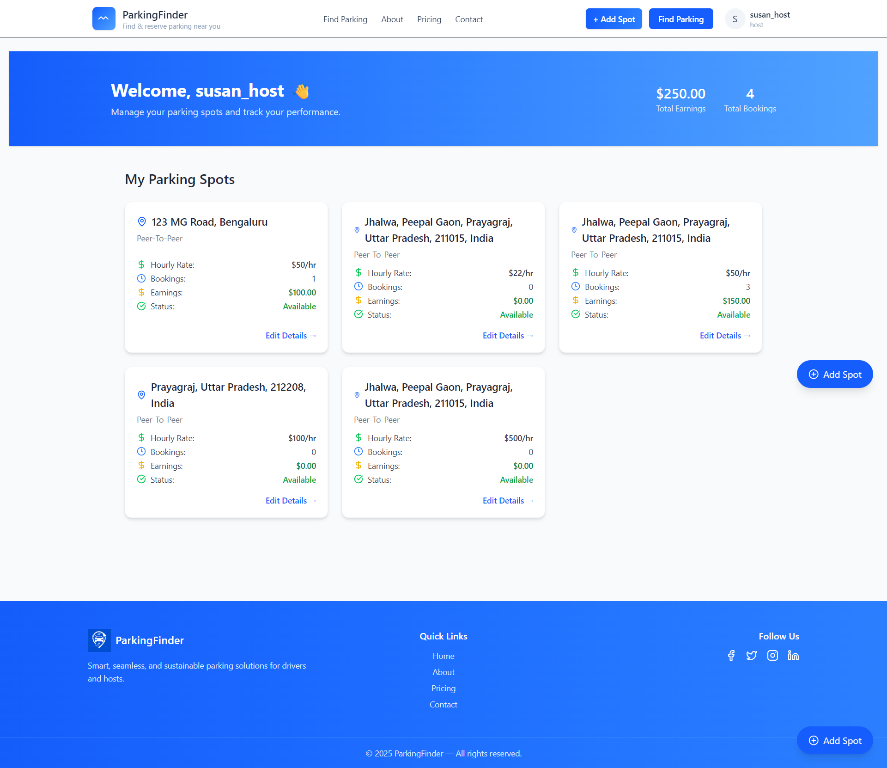
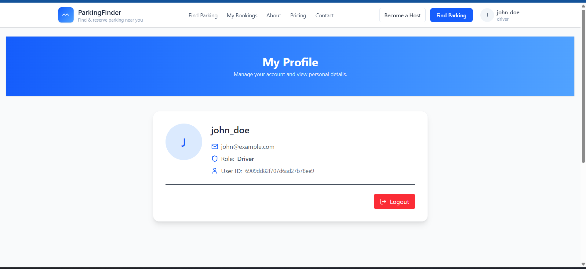

# Parking Finder — Smart Parking Solution

A full-stack MERN application that enables drivers to find and book parking spaces in real time, while allowing hosts to list, manage, and track their parking spots.

Parking Finder offers real-time availability, location-based search, and role-based access, built with modern UI/UX design and scalable architecture.

---

## Overview

**Parking Finder** aims to solve urban parking challenges by providing:

* Real-time parking availability and booking.
* Host-managed spot listings with earnings tracking.
* Map-based visualization using Leaflet + OpenStreetMap.
* Time-slot conflict prevention.
* Role-based authentication (Driver, Host, Admin).
* Dynamic and responsive user interface.

---

## Tech Stack

| Layer                  | Technologies                                                   |
| ---------------------- | -------------------------------------------------------------- |
| **Frontend**           | React (Vite), React Router, Tailwind CSS, Axios, React-Leaflet |
| **Backend**            | Node.js, Express.js                                            |
| **Database**           | MongoDB Atlas                                                  |
| **Authentication**     | JWT (Bearer + HTTP-only Cookies)                               |
| **Map & Geo Services** | Leaflet, OpenStreetMap                                         |
| **UI Components**      | Tailwind CSS, Lucide Icons                                     |

---

## Badges

[](https://reactjs.org)
[](https://nodejs.org)
[](https://expressjs.com)
[](https://www.mongodb.com)
[](https://jwt.io)
[](LICENSE)
[](https://tailwindcss.com)

---

## Project Structure

```
parking-finder/
│
├── backend/
│   ├── controllers/
│   │   ├── auth.controller.js
│   │   ├── bookings.controller.js
│   │   └── spots.controller.js
│   ├── middleware/
│   │   └── auth.middleware.js
│   ├── models/
│   │   ├── user.model.js
│   │   ├── booking.model.js
│   │   └── parkingSpot.model.js
│   ├── routes/
│   │   ├── auth.routes.js
│   │   ├── booking.routes.js
│   │   └── spots.routes.js
│   ├── utils/
│   │   └── generateToken.js
│   └── server.js
│
└── frontend/
    ├── src/
    │   ├── components/
    │   │   ├── Header.jsx
    │   │   ├── Footer.jsx
    │   │   ├── booking/BookingModal.jsx
    │   │   ├── host/
    │   │   └── form/
    │   ├── context/AuthContext.jsx
    │   ├── pages/
    │   │   ├── HomePage.jsx
    │   │   ├── LoginPage.jsx
    │   │   ├── RegisterPage.jsx
    │   │   ├── DashboardPage.jsx
    │   │   ├── HostDashboardPage.jsx
    │   │   ├── AddSpotPage.jsx
    │   │   ├── MapPage.jsx
    │   │   ├── ProfilePage.jsx
    │   │   ├── PricingPage.jsx
    │   │   ├── AboutPage.jsx
    │   │   └── ContactPage.jsx
    │   ├── App.jsx
    │   └── main.jsx
    ├── index.html
    └── tailwind.config.js
```

---

## Setup Instructions

### Prerequisites

* Node.js (v18 or higher)
* MongoDB Atlas or Local MongoDB
* npm or yarn

---

### 1. Clone the Repository

```bash
git clone https://github.com/your-username/parking-finder.git
cd parking-finder
```

---

### 2. Backend Setup

```bash
cd backend
npm install
```

Create a `.env` file inside `/backend`:

```env
PORT=5001
MONGO_URI=mongodb+srv://<username>:<password>@cluster.mongodb.net/parkingfinder
JWT_SECRET=your_secret_key
```

Start the backend:

```bash
npm run dev
```

---

### 3. Frontend Setup

```bash
cd ../frontend
npm install
npm run dev
```

Frontend runs by default at:

```
http://localhost:5173
```

---

## Authentication Flow

* Users register and log in using email and password.
* JWT is issued and stored in an HTTP-only cookie and Authorization header.
* Role-based access ensures separation of driver and host features:

  * **Driver** – Can search and book spots.
  * **Host** – Can list and manage parking spots.
  * **Admin** – (Planned) System-wide management.

---

## Core Features

### Driver Features

* Search and view nearby parking spots via map.
* Filter by distance and view availability.
* Book parking for specific time slots.
* Prevent double-booking or past-time reservations.
* View all bookings in an organized dashboard.

### Host Features

* Add parking spots using interactive map (pin drop).
* Automatic address and coordinate fetching.
* Manage listed spots and view earnings.
* View booking history and availability.

### Map Features

* Leaflet integration with OpenStreetMap.
* Adjustable search radius with dynamic circular overlay.
* Real-time user geolocation detection.
* Marker popups with “Book” action.
* Smooth navigation animations and accurate distance calculation.

### Booking Modal

* Modern blurred background modal.
* Shows upcoming and available time slots.
* Smart time validation.
* Automatic price calculation.
* Clean responsive layout.

---

## Role Permissions

| Role       | Capabilities                                |
| ---------- | ------------------------------------------- |
| **Driver** | View & book parking spots, manage bookings  |
| **Host**   | Add, edit, and delete spots, track earnings |
| **Admin**  | Planned: Manage users, bookings, analytics  |

---

## Screenshots (Previews)

> *(Replace these with your actual screenshots later)*

### Home Page



### Map & Booking



### Dashboard



### Profile Page



---

## Future Enhancements

* Payment integration (Stripe/Razorpay)
* Booking reminders and notifications
* Advanced analytics for hosts
* Admin control panel
* Multi-day booking support

---

## Developer

**Name:** Krishna
**Role:** IT Engineer / Full Stack MERN Developer
**Email:** [support@parkingfinder.com](mailto:support@parkingfinder.com)
**GitHub:** [your-github](https://github.com/your-github)

---

## License

This project is licensed under the **MIT License**.
You are free to use, modify, and distribute this codebase with attribution.

---

## Contribution

Contributions are welcome!

1. Fork the repo
2. Create a feature branch
3. Commit and push
4. Open a Pull Request

---

## Project Status

[]()
[]()
[]()

---

Would you like me to:

* Add **API documentation** (endpoints, payloads, responses)?
* Or include a **setup diagram** (frontend ↔ backend ↔ MongoDB)?

That would make your README production-grade and developer-friendly for open-source release.
